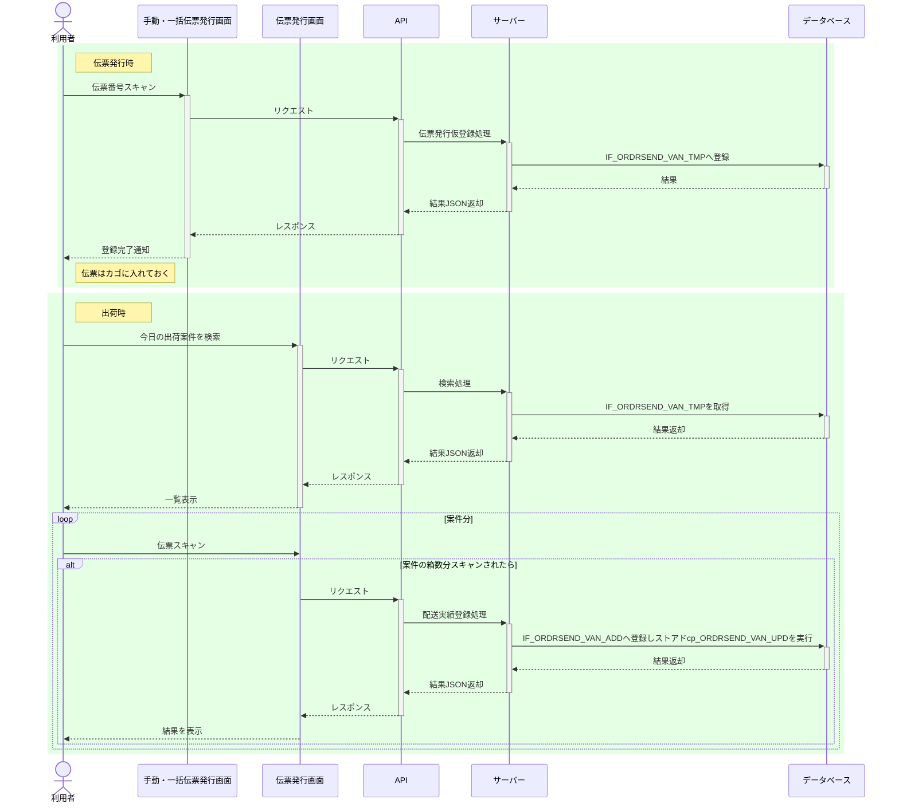

# 伝票番号登録画面シーケンス図

```mermaid
sequenceDiagram
    actor user as 利用者
    participant deliverySystem as 手動・一括伝票発行画面
    participant voucherSystem as 伝票発行画面
    participant api as API
    participant server as サーバー
    participant db as データベース

    rect rgb(0,255,0,0.1)
    note right of user:伝票発行時
        user ->>+ deliverySystem:伝票番号スキャン
        deliverySystem ->>+ api:リクエスト
        api ->>+ server:伝票発行仮登録処理
        server ->>+ db:IF_ORDRSEND_VAN_TMPへ登録
        
        db -->>- server:結果
        server -->>- api:結果JSON返却
        api -->>- deliverySystem:レスポンス
        deliverySystem -->>- user:登録完了通知
    note right of user:伝票はカゴに入れておく
    end

    rect rgb(0,255,0,0.1)
    note right of user:出荷時
        user ->>+ voucherSystem:今日の出荷案件を検索
        voucherSystem ->>+ api:リクエスト
        api ->>+ server:検索処理
        server ->>+ db:IF_ORDRSEND_VAN_TMPを取得

        db -->>- server:結果返却
        server -->>- api:結果JSON返却
        api -->>- voucherSystem:レスポンス
        voucherSystem -->>- user:一覧表示

        loop 案件分
            user ->> voucherSystem:伝票スキャン
            alt 案件の箱数分スキャンされたら
                voucherSystem ->>+ api:リクエスト
                api ->>+ server:配送実績登録処理
                server ->>+ db:IF_ORDRSEND_VAN_ADDへ登録しストアドcp_ORDRSEND_VAN_UPDを実行
        
                db -->>- server:結果返却
                server -->>- api:結果JSON返却
                api -->>- voucherSystem:レスポンス
                voucherSystem -->> user:結果を表示
            end
        end
    end
```