# フローチャート

### 書き始め
```
flowchart LR
```
### フローチャートの向き
フローチャートの向きを以下のタイプに変更できる
- `TD`,`TB` - 上から下
- `LR` - 左から右
- `RL` - 右から左へ
- `BT` - 下から上へ


### ノード

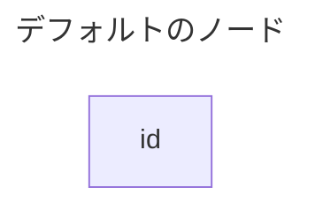

```
---
title: デフォルトのノード
---
flowchart TD
    id
```


```
---
title: テキストを含むノード
---
flowchart TD
    id1[テキストを含むノード1]
    id2[テキストを含むノード2]
```

### ノードの種類

#### 角丸のノード


```
id1(テキストを含むノード1)
```

#### 丸型のノード


```
id1([テキストを含むノード1])
```

#### サブルーチンのノード

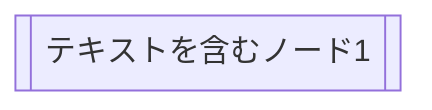

```
id1([テキストを含むノード1])
```

#### データベースのノード

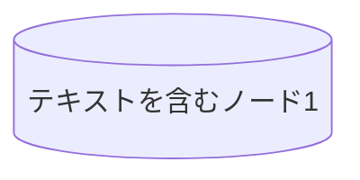

```
id1[(テキストを含むノード1)]
```

#### 円のノード

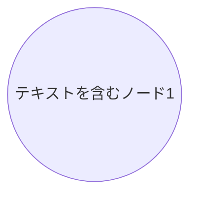

```
id1((テキストを含むノード1))
```

#### リボン形のノード

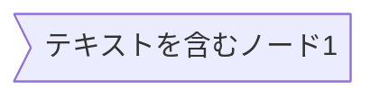

```
id1>テキストを含むノード1]
```

#### 菱形のノード

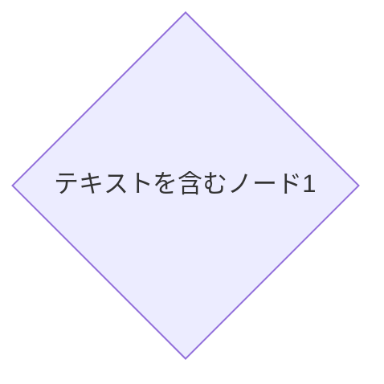

```
id1{テキストを含むノード1}
```

#### 六角形のノード


```
id1{{テキストを含むノード1}}
```

#### 平行四辺形のノード

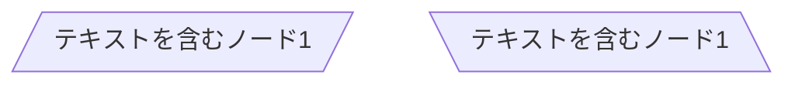

```
id1[/テキストを含むノード1/]
id2[\テキストを含むノード1\]
```

#### 台形のノード

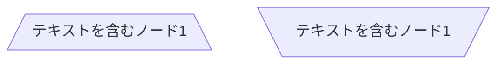

```
id1[/テキストを含むノード1\]
id2[\テキストを含むノード1/]
```

#### 二重丸のノード

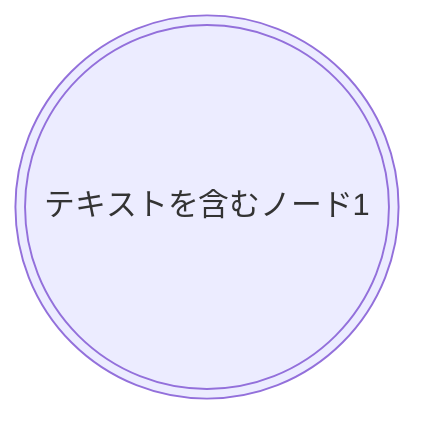

```
id1(((テキストを含むノード1)))
```

### ノード間のリンク

#### 矢印


```
---
title: ノード間のリンクLR
---
flowchart LR
    id1[テキストを含むノード1]
    id2[テキストを含むノード2]

    id1 --> id2
```

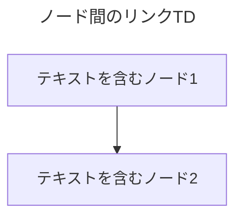

```
---
title: ノード間のリンクTD
---
flowchart TD
    id1[テキストを含むノード1]
    id2[テキストを含むノード2]

    id1 --> id2
```

#### 矢印上のテキスト

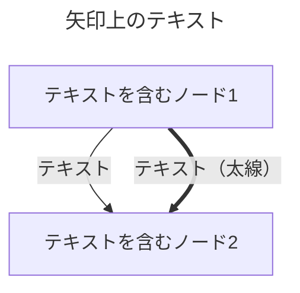

```
---
title: 矢印上のテキスト
---
flowchart TD
    id1[テキストを含むノード1]
    id2[テキストを含むノード2]

    id1-- テキスト　-->id2
    id1== テキスト（太線）　==>id2
```

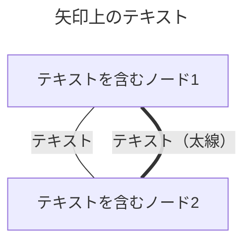

```
---
title: 矢印上のテキスト
---
flowchart TD
    id1[テキストを含むノード1]
    id2[テキストを含むノード2]

    id1---|テキスト|id2
    id1===|テキスト（太線）|id2
```


#### 複数のリンク


```
---
title: 複数のリンク
---
flowchart LR
    id1[テキストを含むノード1]
    id2[テキストを含むノード2]
    id3[テキストを含むノード3]

    id1---|テキスト|id2---|テキスト|id3
```

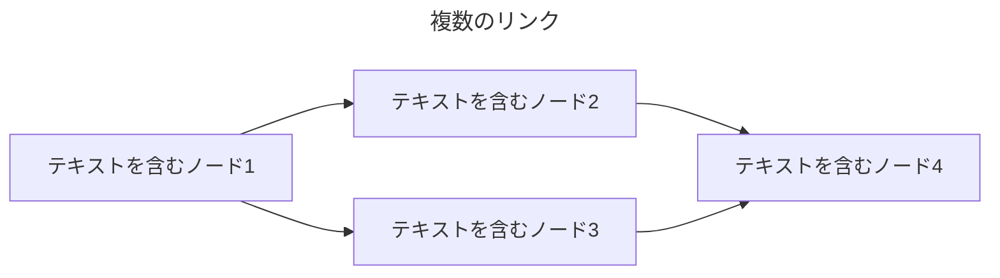

```
---
title: 複数のリンク
---
flowchart LR
    id1[テキストを含むノード1]
    id2[テキストを含むノード2]
    id3[テキストを含むノード3]
    id4[テキストを含むノード4]

    id1 --> id2 & id3 --> id4
```

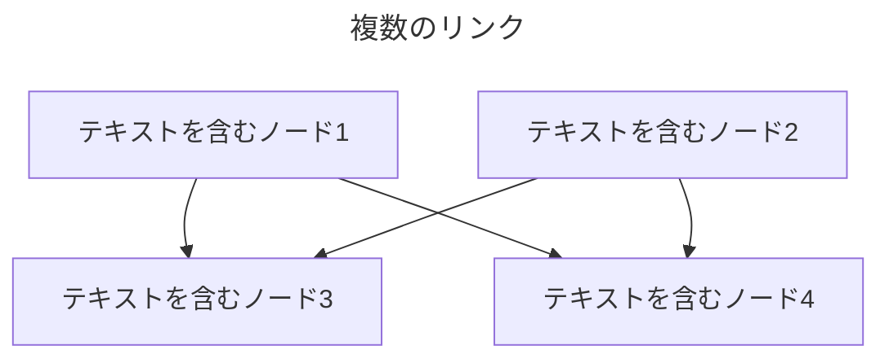

```
---
title: 複数のリンク
---
flowchart TB
    id1[テキストを含むノード1]
    id2[テキストを含むノード2]
    id3[テキストを含むノード3]
    id4[テキストを含むノード4]

    id1 & id2 --> id3 & id4
```

```mermaid
---
title: 複数のリンク
---
flowchart TB
    id1[テキストを含むノード1]
    id2[テキストを含むノード2]
    id3[テキストを含むノード3]
    id4[テキストを含むノード4]

    id1 --> id3 
    id1 --> id4
    id2 --> id3
    id2 --> id4
```

```
---
title: 複数のリンク
---
flowchart TB
    id1[テキストを含むノード1]
    id2[テキストを含むノード2]
    id3[テキストを含むノード3]
    id4[テキストを含むノード4]

    id1 --> id3 
    id1 --> id4
    id2 --> id3
    id2 --> id4
```


### 分岐

```mermaid
flowchart TD
    START[Start]
    A{条件式}
    B[分岐１-1]
    C[分岐１-2]
    END[END]

    START --> A
    A -- Yes --> B
    C --> A
    B --> C
    A -- No ----> END
```
