# シーケンス図

### 書き始め
```
sequenceDiagram
```

### 人型シーケンス

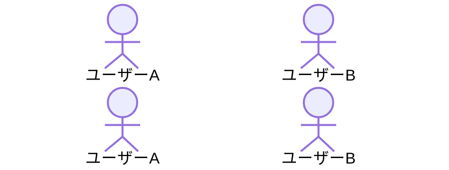

```
sequenceDiagram
    actor ユーザーA
    actor ユーザーB
```

### オブジェクトの定義

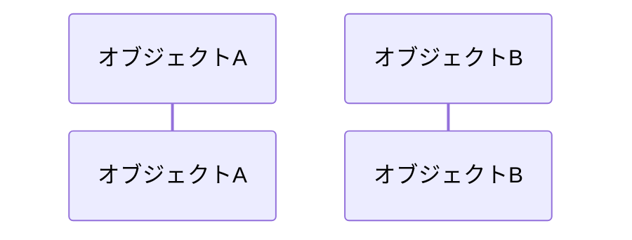

```
sequenceDiagram
    participant オブジェクトA
    participant オブジェクトB
```


### 矢印（実線）

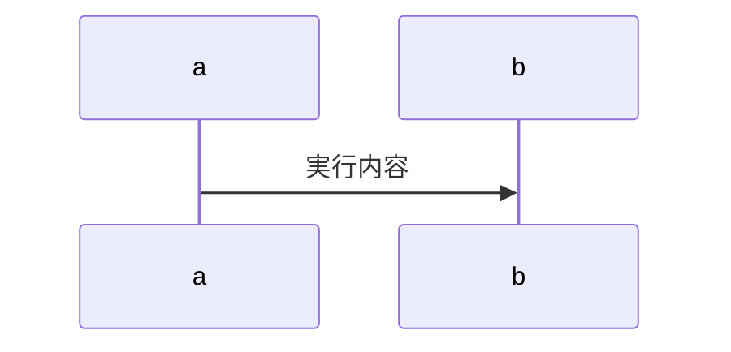

```
sequenceDiagram
    a ->> b:実行内容
```

### 矢印（点線）

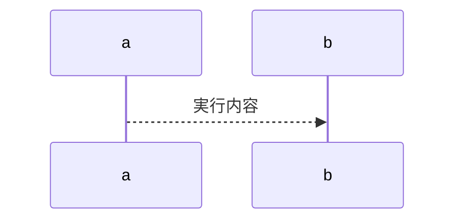

```
sequenceDiagram
    a -->> b:実行内容
```

### その他の矢印

| タイプ   | 説明             |
| -------- | ---------------- |
| `->`     | 矢印のない実線   |
| `-->`    | 矢印のない点線   |
| `<<->>`  | 双方向実線       |
| `<<-->>` | 双方向点線       |
| `-x`     | バツ印の実線     |
| `--x`    | バツ印の点線     |
| `-)`     | 開いた矢印の実線 |
| `--)`    | 開いた矢印の点線 |


### ライフラインの実行状態

`activate 〇〇` `deactivate 〇〇` と書く方法、または `+` `-` といったように書く方法がある。

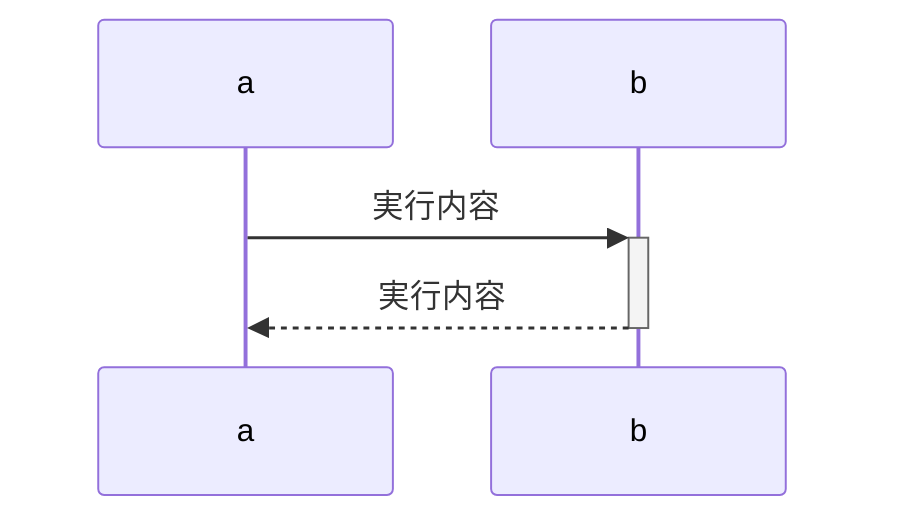

```
sequenceDiagram
    a ->>+ b:実行内容
    b -->>- a:実行内容
```


```
sequenceDiagram
    a ->> b:実行内容
        activate b
    b -->> a:実行内容
        deactivate b
```

### メモ
シーケンス図内に以下の種類のメモを追加する
- オブジェクトの左右に配置するメモ
- ライフラインにまたがるメモ


### オブジェクトの左右に配置するメモ
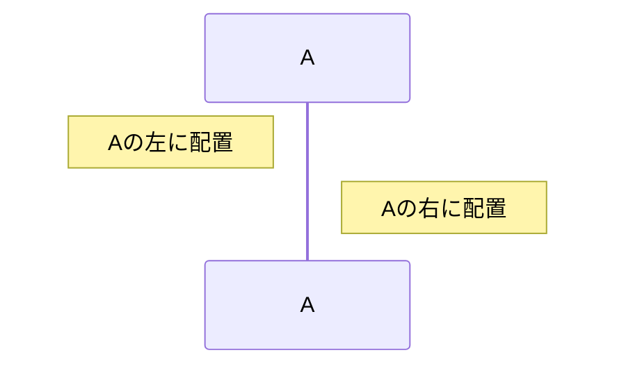

```
sequenceDiagram
    participant A as A

    Note left of A:Aの左に配置
    Note right of A:Aの右に配置
```


### ライフラインにまたがるメモ
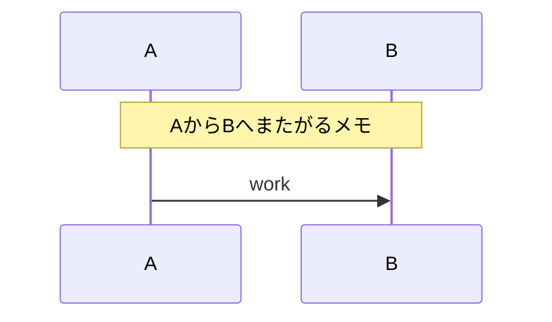

```
sequenceDiagram
    participant A as A
    participant B as B

    Note over A,B:AからBへまたがるメモ
    A ->> B:work
```

### エイリアスの定義
識別子をつけることで、効率よく書くことができる

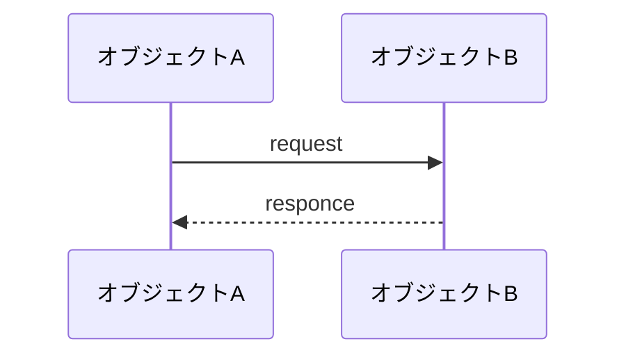

```
sequenceDiagram
    participant A as オブジェクトA
    participant B as オブジェクトB


    A ->> B:request
    B -->> A:responce
```


### ループ

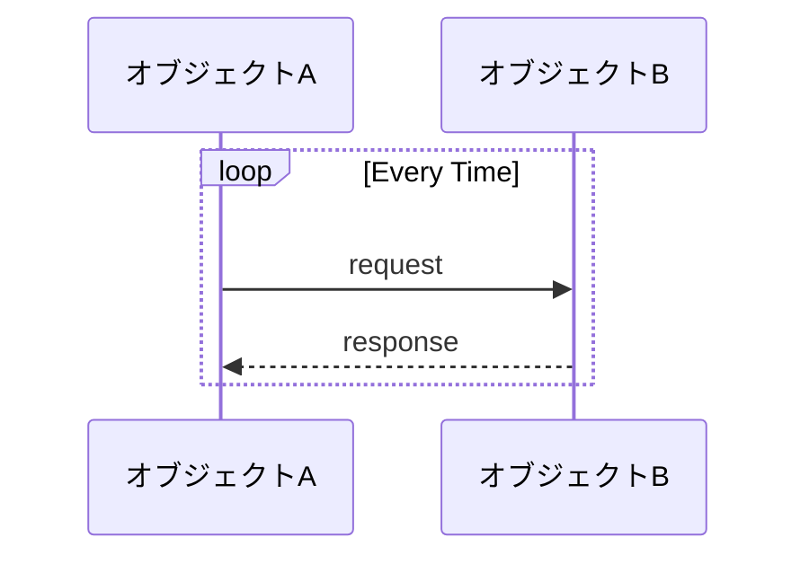

```
sequenceDiagram
    participant A as オブジェクトA
    participant B as オブジェクトB

    loop Every Time
        A ->> B:request
        B -->> A:response
    end
```

### 分岐条件

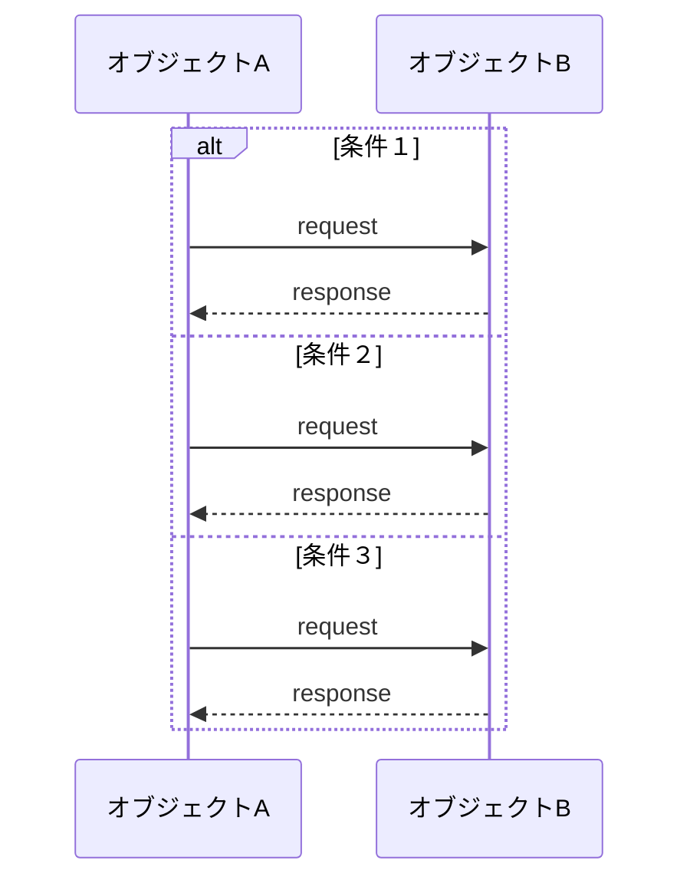

```
sequenceDiagram
    participant A as オブジェクトA
    participant B as オブジェクトB

    alt 条件１
        A ->> B:request
        B -->> A:response
    else 条件２
        A ->> B:request
        B -->> A:response
    else 条件３
        A ->> B:request
        B -->> A:response
    end
```

### 並行処理


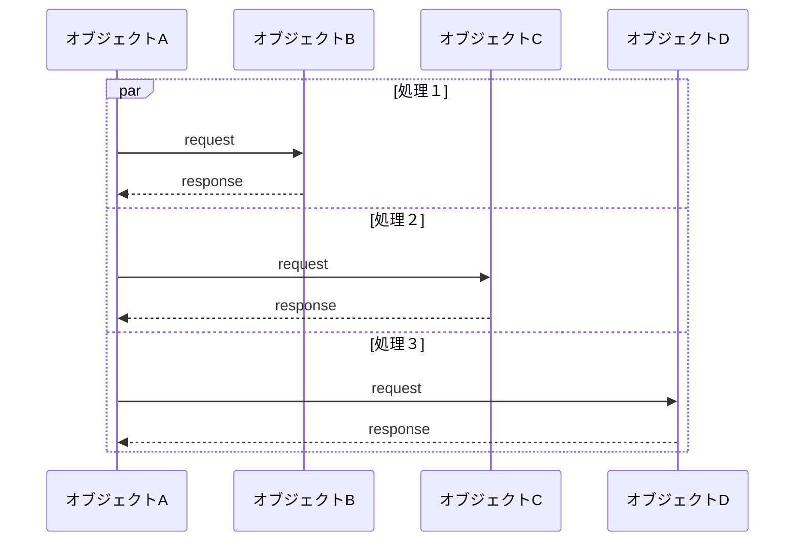

```
sequenceDiagram
    participant A as オブジェクトA
    participant B as オブジェクトB
    participant C as オブジェクトC
    participant D as オブジェクトD

    par 処理１
        A ->> B:request
        B -->> A:response
    and 処理２
        A ->> C:request
        C -->> A:response
    and 処理３
        A ->> D:request
        D -->> A:response
    end
```

### コメント


```
sequenceDiagram
    %% この文章はシーケンス図に表示されない
    
    %% オブジェクトの定義
    participant A as オブジェクトA
    participant B as オブジェクトB


    %% シーケンス開始
    A ->> B:request
    B -->> A:responce
    %% シーケンス終了
```